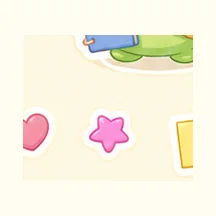
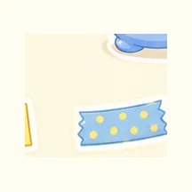
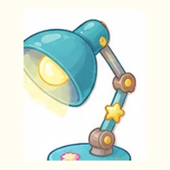
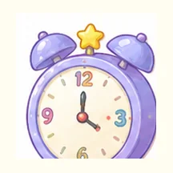
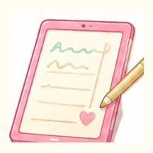
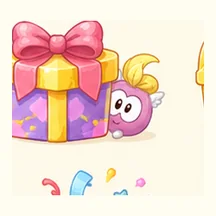

---
hide:
  - toc
---

# 素材库

<section class="manor-page-hero manor-page-hero--assets">
  

    
Asset Library

    <h2>从素材库选取小图标</h2>
    
这里收纳已经从原始素材图切分、压缩并统一尺寸的小图标。点击复制后可直接粘贴到 Markdown 页面中。

  

</section>

<section class="asset-library" data-asset-library>
  

    <label>
      搜索素材
      <input id="asset-search" type="search" placeholder="输入功能、贴纸、学习小物、成就或文件名" />
    </label>
    

      <button type="button" data-asset-filter="all" aria-pressed="true">全部</button>
    <button type="button" data-asset-filter="functional">功能入口</button>
    <button type="button" data-asset-filter="sticker">卡通贴纸</button>
    <button type="button" data-asset-filter="study-item">学习小物</button>
    <button type="button" data-asset-filter="achievement">成就徽章</button>
    

  

  

    <article class="asset-card" data-asset-name="功能入口 01 首页房屋 functional-01.webp" data-asset-category="functional">
      
      <strong>功能入口 01 首页房屋</strong>
      功能入口
      <code>/Medical-VLM/assets/images/library/icons/functional-01.webp</code>
      <button type="button" data-copy-asset="">复制 Markdown</button>
    </article>
    <article class="asset-card" data-asset-name="功能入口 02 写作便签 functional-02.webp" data-asset-category="functional">
      
      <strong>功能入口 02 写作便签</strong>
      功能入口
      <code>/Medical-VLM/assets/images/library/icons/functional-02.webp</code>
      <button type="button" data-copy-asset="">复制 Markdown</button>
    </article>
    <article class="asset-card" data-asset-name="功能入口 03 学习本 functional-03.webp" data-asset-category="functional">
      
      <strong>功能入口 03 学习本</strong>
      功能入口
      <code>/Medical-VLM/assets/images/library/icons/functional-03.webp</code>
      <button type="button" data-copy-asset="">复制 Markdown</button>
    </article>
    <article class="asset-card" data-asset-name="功能入口 04 任务清单 functional-04.webp" data-asset-category="functional">
      
      <strong>功能入口 04 任务清单</strong>
      功能入口
      <code>/Medical-VLM/assets/images/library/icons/functional-04.webp</code>
      <button type="button" data-copy-asset="">复制 Markdown</button>
    </article>
    <article class="asset-card" data-asset-name="功能入口 05 日历计划 functional-05.webp" data-asset-category="functional">
      
      <strong>功能入口 05 日历计划</strong>
      功能入口
      <code>/Medical-VLM/assets/images/library/icons/functional-05.webp</code>
      <button type="button" data-copy-asset="">复制 Markdown</button>
    </article>
    <article class="asset-card" data-asset-name="功能入口 06 待办笔记 functional-06.webp" data-asset-category="functional">
      
      <strong>功能入口 06 待办笔记</strong>
      功能入口
      <code>/Medical-VLM/assets/images/library/icons/functional-06.webp</code>
      <button type="button" data-copy-asset="">复制 Markdown</button>
    </article>
    <article class="asset-card" data-asset-name="功能入口 07 标签分类 functional-07.webp" data-asset-category="functional">
      
      <strong>功能入口 07 标签分类</strong>
      功能入口
      <code>/Medical-VLM/assets/images/library/icons/functional-07.webp</code>
      <button type="button" data-copy-asset="">复制 Markdown</button>
    </article>
    <article class="asset-card" data-asset-name="功能入口 08 收藏星标 functional-08.webp" data-asset-category="functional">
      
      <strong>功能入口 08 收藏星标</strong>
      功能入口
      <code>/Medical-VLM/assets/images/library/icons/functional-08.webp</code>
      <button type="button" data-copy-asset="">复制 Markdown</button>
    </article>
    <article class="asset-card" data-asset-name="功能入口 09 归档盒子 functional-09.webp" data-asset-category="functional">
      
      <strong>功能入口 09 归档盒子</strong>
      功能入口
      <code>/Medical-VLM/assets/images/library/icons/functional-09.webp</code>
      <button type="button" data-copy-asset="">复制 Markdown</button>
    </article>
    <article class="asset-card" data-asset-name="功能入口 10 搜索放大镜 functional-10.webp" data-asset-category="functional">
      
      <strong>功能入口 10 搜索放大镜</strong>
      功能入口
      <code>/Medical-VLM/assets/images/library/icons/functional-10.webp</code>
      <button type="button" data-copy-asset="">复制 Markdown</button>
    </article>
    <article class="asset-card" data-asset-name="功能入口 11 设置齿轮 functional-11.webp" data-asset-category="functional">
      
      <strong>功能入口 11 设置齿轮</strong>
      功能入口
      <code>/Medical-VLM/assets/images/library/icons/functional-11.webp</code>
      <button type="button" data-copy-asset="">复制 Markdown</button>
    </article>
    <article class="asset-card" data-asset-name="功能入口 12 个人头像 functional-12.webp" data-asset-category="functional">
      
      <strong>功能入口 12 个人头像</strong>
      功能入口
      <code>/Medical-VLM/assets/images/library/icons/functional-12.webp</code>
      <button type="button" data-copy-asset="">复制 Markdown</button>
    </article>
    <article class="asset-card" data-asset-name="功能入口 13 评论消息 functional-13.webp" data-asset-category="functional">
      
      <strong>功能入口 13 评论消息</strong>
      功能入口
      <code>/Medical-VLM/assets/images/library/icons/functional-13.webp</code>
      <button type="button" data-copy-asset="">复制 Markdown</button>
    </article>
    <article class="asset-card" data-asset-name="功能入口 14 上传云朵 functional-14.webp" data-asset-category="functional">
      
      <strong>功能入口 14 上传云朵</strong>
      功能入口
      <code>/Medical-VLM/assets/images/library/icons/functional-14.webp</code>
      <button type="button" data-copy-asset="">复制 Markdown</button>
    </article>
    <article class="asset-card" data-asset-name="功能入口 15 下载云朵 functional-15.webp" data-asset-category="functional">
      
      <strong>功能入口 15 下载云朵</strong>
      功能入口
      <code>/Medical-VLM/assets/images/library/icons/functional-15.webp</code>
      <button type="button" data-copy-asset="">复制 Markdown</button>
    </article>
    <article class="asset-card" data-asset-name="功能入口 16 书签收藏 functional-16.webp" data-asset-category="functional">
      
      <strong>功能入口 16 书签收藏</strong>
      功能入口
      <code>/Medical-VLM/assets/images/library/icons/functional-16.webp</code>
      <button type="button" data-copy-asset="">复制 Markdown</button>
    </article>
    <article class="asset-card" data-asset-name="功能入口 17 提醒铃铛 functional-17.webp" data-asset-category="functional">
      
      <strong>功能入口 17 提醒铃铛</strong>
      功能入口
      <code>/Medical-VLM/assets/images/library/icons/functional-17.webp</code>
      <button type="button" data-copy-asset="">复制 Markdown</button>
    </article>
    <article class="asset-card" data-asset-name="功能入口 18 计时闹钟 functional-18.webp" data-asset-category="functional">
      
      <strong>功能入口 18 计时闹钟</strong>
      功能入口
      <code>/Medical-VLM/assets/images/library/icons/functional-18.webp</code>
      <button type="button" data-copy-asset="">复制 Markdown</button>
    </article>
    <article class="asset-card" data-asset-name="功能入口 19 数据图表 functional-19.webp" data-asset-category="functional">
      
      <strong>功能入口 19 数据图表</strong>
      功能入口
      <code>/Medical-VLM/assets/images/library/icons/functional-19.webp</code>
      <button type="button" data-copy-asset="">复制 Markdown</button>
    </article>
    <article class="asset-card" data-asset-name="功能入口 20 文件夹 functional-20.webp" data-asset-category="functional">
      
      <strong>功能入口 20 文件夹</strong>
      功能入口
      <code>/Medical-VLM/assets/images/library/icons/functional-20.webp</code>
      <button type="button" data-copy-asset="">复制 Markdown</button>
    </article>
    <article class="asset-card" data-asset-name="功能入口 21 图片相册 functional-21.webp" data-asset-category="functional">
      
      <strong>功能入口 21 图片相册</strong>
      功能入口
      <code>/Medical-VLM/assets/images/library/icons/functional-21.webp</code>
      <button type="button" data-copy-asset="">复制 Markdown</button>
    </article>
    <article class="asset-card" data-asset-name="功能入口 22 音乐音符 functional-22.webp" data-asset-category="functional">
      
      <strong>功能入口 22 音乐音符</strong>
      功能入口
      <code>/Medical-VLM/assets/images/library/icons/functional-22.webp</code>
      <button type="button" data-copy-asset="">复制 Markdown</button>
    </article>
    <article class="asset-card" data-asset-name="功能入口 23 商店小屋 functional-23.webp" data-asset-category="functional">
      
      <strong>功能入口 23 商店小屋</strong>
      功能入口
      <code>/Medical-VLM/assets/images/library/icons/functional-23.webp</code>
      <button type="button" data-copy-asset="">复制 Markdown</button>
    </article>
    <article class="asset-card" data-asset-name="功能入口 24 礼物奖励 functional-24.webp" data-asset-category="functional">
      
      <strong>功能入口 24 礼物奖励</strong>
      功能入口
      <code>/Medical-VLM/assets/images/library/icons/functional-24.webp</code>
      <button type="button" data-copy-asset="">复制 Markdown</button>
    </article>
    <article class="asset-card" data-asset-name="功能入口 25 绘画调色盘 functional-25.webp" data-asset-category="functional">
      
      <strong>功能入口 25 绘画调色盘</strong>
      功能入口
      <code>/Medical-VLM/assets/images/library/icons/functional-25.webp</code>
      <button type="button" data-copy-asset="">复制 Markdown</button>
    </article>
    <article class="asset-card" data-asset-name="功能入口 26 退出入口 functional-26.webp" data-asset-category="functional">
      
      <strong>功能入口 26 退出入口</strong>
      功能入口
      <code>/Medical-VLM/assets/images/library/icons/functional-26.webp</code>
      <button type="button" data-copy-asset="">复制 Markdown</button>
    </article>
    <article class="asset-card" data-asset-name="功能入口 27 阅读台灯 functional-27.webp" data-asset-category="functional">
      
      <strong>功能入口 27 阅读台灯</strong>
      功能入口
      <code>/Medical-VLM/assets/images/library/icons/functional-27.webp</code>
      <button type="button" data-copy-asset="">复制 Markdown</button>
    </article>
    <article class="asset-card" data-asset-name="功能入口 28 植物成长 functional-28.webp" data-asset-category="functional">
      
      <strong>功能入口 28 植物成长</strong>
      功能入口
      <code>/Medical-VLM/assets/images/library/icons/functional-28.webp</code>
      <button type="button" data-copy-asset="">复制 Markdown</button>
    </article>
    <article class="asset-card" data-asset-name="功能入口 29 便签备忘 functional-29.webp" data-asset-category="functional">
      
      <strong>功能入口 29 便签备忘</strong>
      功能入口
      <code>/Medical-VLM/assets/images/library/icons/functional-29.webp</code>
      <button type="button" data-copy-asset="">复制 Markdown</button>
    </article>
    <article class="asset-card" data-asset-name="功能入口 30 安全锁 functional-30.webp" data-asset-category="functional">
      
      <strong>功能入口 30 安全锁</strong>
      功能入口
      <code>/Medical-VLM/assets/images/library/icons/functional-30.webp</code>
      <button type="button" data-copy-asset="">复制 Markdown</button>
    </article>
    <article class="asset-card" data-asset-name="卡通贴纸 01 阅读 sticker-01.webp" data-asset-category="sticker">
      
      <strong>卡通贴纸 01 阅读</strong>
      卡通贴纸
      <code>/Medical-VLM/assets/images/library/icons/sticker-01.webp</code>
      <button type="button" data-copy-asset="">复制 Markdown</button>
    </article>
    <article class="asset-card" data-asset-name="卡通贴纸 02 写作 sticker-02.webp" data-asset-category="sticker">
      
      <strong>卡通贴纸 02 写作</strong>
      卡通贴纸
      <code>/Medical-VLM/assets/images/library/icons/sticker-02.webp</code>
      <button type="button" data-copy-asset="">复制 Markdown</button>
    </article>
    <article class="asset-card" data-asset-name="卡通贴纸 03 铅笔 sticker-03.webp" data-asset-category="sticker">
      
      <strong>卡通贴纸 03 铅笔</strong>
      卡通贴纸
      <code>/Medical-VLM/assets/images/library/icons/sticker-03.webp</code>
      <button type="button" data-copy-asset="">复制 Markdown</button>
    </article>
    <article class="asset-card" data-asset-name="卡通贴纸 04 睡觉 sticker-04.webp" data-asset-category="sticker">
      
      <strong>卡通贴纸 04 睡觉</strong>
      卡通贴纸
      <code>/Medical-VLM/assets/images/library/icons/sticker-04.webp</code>
      <button type="button" data-copy-asset="">复制 Markdown</button>
    </article>
    <article class="asset-card" data-asset-name="卡通贴纸 05 加油 sticker-05.webp" data-asset-category="sticker">
      
      <strong>卡通贴纸 05 加油</strong>
      卡通贴纸
      <code>/Medical-VLM/assets/images/library/icons/sticker-05.webp</code>
      <button type="button" data-copy-asset="">复制 Markdown</button>
    </article>
    <article class="asset-card" data-asset-name="卡通贴纸 06 思考 sticker-06.webp" data-asset-category="sticker">
      
      <strong>卡通贴纸 06 思考</strong>
      卡通贴纸
      <code>/Medical-VLM/assets/images/library/icons/sticker-06.webp</code>
      <button type="button" data-copy-asset="">复制 Markdown</button>
    </article>
    <article class="asset-card" data-asset-name="卡通贴纸 07 惊讶 sticker-07.webp" data-asset-category="sticker">
      
      <strong>卡通贴纸 07 惊讶</strong>
      卡通贴纸
      <code>/Medical-VLM/assets/images/library/icons/sticker-07.webp</code>
      <button type="button" data-copy-asset="">复制 Markdown</button>
    </article>
    <article class="asset-card" data-asset-name="卡通贴纸 08 眼镜阅读 sticker-08.webp" data-asset-category="sticker">
      
      <strong>卡通贴纸 08 眼镜阅读</strong>
      卡通贴纸
      <code>/Medical-VLM/assets/images/library/icons/sticker-08.webp</code>
      <button type="button" data-copy-asset="">复制 Markdown</button>
    </article>
    <article class="asset-card" data-asset-name="卡通贴纸 09 作业 sticker-09.webp" data-asset-category="sticker">
      
      <strong>卡通贴纸 09 作业</strong>
      卡通贴纸
      <code>/Medical-VLM/assets/images/library/icons/sticker-09.webp</code>
      <button type="button" data-copy-asset="">复制 Markdown</button>
    </article>
    <article class="asset-card" data-asset-name="卡通贴纸 10 便签 sticker-10.webp" data-asset-category="sticker">
      
      <strong>卡通贴纸 10 便签</strong>
      卡通贴纸
      <code>/Medical-VLM/assets/images/library/icons/sticker-10.webp</code>
      <button type="button" data-copy-asset="">复制 Markdown</button>
    </article>
    <article class="asset-card" data-asset-name="卡通贴纸 11 文件夹 sticker-11.webp" data-asset-category="sticker">
      
      <strong>卡通贴纸 11 文件夹</strong>
      卡通贴纸
      <code>/Medical-VLM/assets/images/library/icons/sticker-11.webp</code>
      <button type="button" data-copy-asset="">复制 Markdown</button>
    </article>
    <article class="asset-card" data-asset-name="卡通贴纸 12 星星 sticker-12.webp" data-asset-category="sticker">
      
      <strong>卡通贴纸 12 星星</strong>
      卡通贴纸
      <code>/Medical-VLM/assets/images/library/icons/sticker-12.webp</code>
      <button type="button" data-copy-asset="">复制 Markdown</button>
    </article>
    <article class="asset-card" data-asset-name="卡通贴纸 13 咖啡 sticker-13.webp" data-asset-category="sticker">
      
      <strong>卡通贴纸 13 咖啡</strong>
      卡通贴纸
      <code>/Medical-VLM/assets/images/library/icons/sticker-13.webp</code>
      <button type="button" data-copy-asset="">复制 Markdown</button>
    </article>
    <article class="asset-card" data-asset-name="卡通贴纸 14 浇水 sticker-14.webp" data-asset-category="sticker">
      
      <strong>卡通贴纸 14 浇水</strong>
      卡通贴纸
      <code>/Medical-VLM/assets/images/library/icons/sticker-14.webp</code>
      <button type="button" data-copy-asset="">复制 Markdown</button>
    </article>
    <article class="asset-card" data-asset-name="卡通贴纸 15 疑问 sticker-15.webp" data-asset-category="sticker">
      
      <strong>卡通贴纸 15 疑问</strong>
      卡通贴纸
      <code>/Medical-VLM/assets/images/library/icons/sticker-15.webp</code>
      <button type="button" data-copy-asset="">复制 Markdown</button>
    </article>
    <article class="asset-card" data-asset-name="卡通贴纸 16 加油便签 sticker-16.webp" data-asset-category="sticker">
      
      <strong>卡通贴纸 16 加油便签</strong>
      卡通贴纸
      <code>/Medical-VLM/assets/images/library/icons/sticker-16.webp</code>
      <button type="button" data-copy-asset="">复制 Markdown</button>
    </article>
    <article class="asset-card" data-asset-name="卡通贴纸 17 读书 sticker-17.webp" data-asset-category="sticker">
      
      <strong>卡通贴纸 17 读书</strong>
      卡通贴纸
      <code>/Medical-VLM/assets/images/library/icons/sticker-17.webp</code>
      <button type="button" data-copy-asset="">复制 Markdown</button>
    </article>
    <article class="asset-card" data-asset-name="卡通贴纸 18 书堆 sticker-18.webp" data-asset-category="sticker">
      
      <strong>卡通贴纸 18 书堆</strong>
      卡通贴纸
      <code>/Medical-VLM/assets/images/library/icons/sticker-18.webp</code>
      <button type="button" data-copy-asset="">复制 Markdown</button>
    </article>
    <article class="asset-card" data-asset-name="卡通贴纸 19 爱心 sticker-19.webp" data-asset-category="sticker">
      
      <strong>卡通贴纸 19 爱心</strong>
      卡通贴纸
      <code>/Medical-VLM/assets/images/library/icons/sticker-19.webp</code>
      <button type="button" data-copy-asset="">复制 Markdown</button>
    </article>
    <article class="asset-card" data-asset-name="卡通贴纸 20 成绩单 sticker-20.webp" data-asset-category="sticker">
      
      <strong>卡通贴纸 20 成绩单</strong>
      卡通贴纸
      <code>/Medical-VLM/assets/images/library/icons/sticker-20.webp</code>
      <button type="button" data-copy-asset="">复制 Markdown</button>
    </article>
    <article class="asset-card" data-asset-name="卡通贴纸 21 四叶草 sticker-21.webp" data-asset-category="sticker">
      
      <strong>卡通贴纸 21 四叶草</strong>
      卡通贴纸
      <code>/Medical-VLM/assets/images/library/icons/sticker-21.webp</code>
      <button type="button" data-copy-asset="">复制 Markdown</button>
    </article>
    <article class="asset-card" data-asset-name="卡通贴纸 22 背包 sticker-22.webp" data-asset-category="sticker">
      
      <strong>卡通贴纸 22 背包</strong>
      卡通贴纸
      <code>/Medical-VLM/assets/images/library/icons/sticker-22.webp</code>
      <button type="button" data-copy-asset="">复制 Markdown</button>
    </article>
    <article class="asset-card" data-asset-name="卡通贴纸 23 打招呼 sticker-23.webp" data-asset-category="sticker">
      
      <strong>卡通贴纸 23 打招呼</strong>
      卡通贴纸
      <code>/Medical-VLM/assets/images/library/icons/sticker-23.webp</code>
      <button type="button" data-copy-asset="">复制 Markdown</button>
    </article>
    <article class="asset-card" data-asset-name="卡通贴纸 24 庆祝 sticker-24.webp" data-asset-category="sticker">
      
      <strong>卡通贴纸 24 庆祝</strong>
      卡通贴纸
      <code>/Medical-VLM/assets/images/library/icons/sticker-24.webp</code>
      <button type="button" data-copy-asset="">复制 Markdown</button>
    </article>
    <article class="asset-card" data-asset-name="卡通贴纸 25 认真学习气泡 sticker-25.webp" data-asset-category="sticker">
      
      <strong>卡通贴纸 25 认真学习气泡</strong>
      卡通贴纸
      <code>/Medical-VLM/assets/images/library/icons/sticker-25.webp</code>
      <button type="button" data-copy-asset="">复制 Markdown</button>
    </article>
    <article class="asset-card" data-asset-name="卡通贴纸 26 快乐学习气泡 sticker-26.webp" data-asset-category="sticker">
      
      <strong>卡通贴纸 26 快乐学习气泡</strong>
      卡通贴纸
      <code>/Medical-VLM/assets/images/library/icons/sticker-26.webp</code>
      <button type="button" data-copy-asset="">复制 Markdown</button>
    </article>
    <article class="asset-card" data-asset-name="卡通贴纸 27 幸运贴纸 sticker-27.webp" data-asset-category="sticker">
      
      <strong>卡通贴纸 27 幸运贴纸</strong>
      卡通贴纸
      <code>/Medical-VLM/assets/images/library/icons/sticker-27.webp</code>
      <button type="button" data-copy-asset="">复制 Markdown</button>
    </article>
    <article class="asset-card" data-asset-name="卡通贴纸 28 便签组 sticker-28.webp" data-asset-category="sticker">
      
      <strong>卡通贴纸 28 便签组</strong>
      卡通贴纸
      <code>/Medical-VLM/assets/images/library/icons/sticker-28.webp</code>
      <button type="button" data-copy-asset="">复制 Markdown</button>
    </article>
    <article class="asset-card" data-asset-name="卡通贴纸 29 胶带 sticker-29.webp" data-asset-category="sticker">
      
      <strong>卡通贴纸 29 胶带</strong>
      卡通贴纸
      <code>/Medical-VLM/assets/images/library/icons/sticker-29.webp</code>
      <button type="button" data-copy-asset="">复制 Markdown</button>
    </article>
    <article class="asset-card" data-asset-name="卡通贴纸 30 剪贴板 sticker-30.webp" data-asset-category="sticker">
      
      <strong>卡通贴纸 30 剪贴板</strong>
      卡通贴纸
      <code>/Medical-VLM/assets/images/library/icons/sticker-30.webp</code>
      <button type="button" data-copy-asset="">复制 Markdown</button>
    </article>
    <article class="asset-card" data-asset-name="学习小物 01 打开的书 study-item-01.webp" data-asset-category="study-item">
      
      <strong>学习小物 01 打开的书</strong>
      学习小物
      <code>/Medical-VLM/assets/images/library/icons/study-item-01.webp</code>
      <button type="button" data-copy-asset="">复制 Markdown</button>
    </article>
    <article class="asset-card" data-asset-name="学习小物 02 书本堆 study-item-02.webp" data-asset-category="study-item">
      
      <strong>学习小物 02 书本堆</strong>
      学习小物
      <code>/Medical-VLM/assets/images/library/icons/study-item-02.webp</code>
      <button type="button" data-copy-asset="">复制 Markdown</button>
    </article>
    <article class="asset-card" data-asset-name="学习小物 03 笔筒 study-item-03.webp" data-asset-category="study-item">
      
      <strong>学习小物 03 笔筒</strong>
      学习小物
      <code>/Medical-VLM/assets/images/library/icons/study-item-03.webp</code>
      <button type="button" data-copy-asset="">复制 Markdown</button>
    </article>
    <article class="asset-card" data-asset-name="学习小物 04 铅笔 study-item-04.webp" data-asset-category="study-item">
      
      <strong>学习小物 04 铅笔</strong>
      学习小物
      <code>/Medical-VLM/assets/images/library/icons/study-item-04.webp</code>
      <button type="button" data-copy-asset="">复制 Markdown</button>
    </article>
    <article class="asset-card" data-asset-name="学习小物 05 尺子 study-item-05.webp" data-asset-category="study-item">
      
      <strong>学习小物 05 尺子</strong>
      学习小物
      <code>/Medical-VLM/assets/images/library/icons/study-item-05.webp</code>
      <button type="button" data-copy-asset="">复制 Markdown</button>
    </article>
    <article class="asset-card" data-asset-name="学习小物 06 橡皮 study-item-06.webp" data-asset-category="study-item">
      
      <strong>学习小物 06 橡皮</strong>
      学习小物
      <code>/Medical-VLM/assets/images/library/icons/study-item-06.webp</code>
      <button type="button" data-copy-asset="">复制 Markdown</button>
    </article>
    <article class="asset-card" data-asset-name="学习小物 07 回形针 study-item-07.webp" data-asset-category="study-item">
      
      <strong>学习小物 07 回形针</strong>
      学习小物
      <code>/Medical-VLM/assets/images/library/icons/study-item-07.webp</code>
      <button type="button" data-copy-asset="">复制 Markdown</button>
    </article>
    <article class="asset-card" data-asset-name="学习小物 08 放大镜 study-item-08.webp" data-asset-category="study-item">
      
      <strong>学习小物 08 放大镜</strong>
      学习小物
      <code>/Medical-VLM/assets/images/library/icons/study-item-08.webp</code>
      <button type="button" data-copy-asset="">复制 Markdown</button>
    </article>
    <article class="asset-card" data-asset-name="学习小物 09 书包 study-item-09.webp" data-asset-category="study-item">
      
      <strong>学习小物 09 书包</strong>
      学习小物
      <code>/Medical-VLM/assets/images/library/icons/study-item-09.webp</code>
      <button type="button" data-copy-asset="">复制 Markdown</button>
    </article>
    <article class="asset-card" data-asset-name="学习小物 10 台灯 study-item-10.webp" data-asset-category="study-item">
      
      <strong>学习小物 10 台灯</strong>
      学习小物
      <code>/Medical-VLM/assets/images/library/icons/study-item-10.webp</code>
      <button type="button" data-copy-asset="">复制 Markdown</button>
    </article>
    <article class="asset-card" data-asset-name="学习小物 11 马克杯 study-item-11.webp" data-asset-category="study-item">
      
      <strong>学习小物 11 马克杯</strong>
      学习小物
      <code>/Medical-VLM/assets/images/library/icons/study-item-11.webp</code>
      <button type="button" data-copy-asset="">复制 Markdown</button>
    </article>
    <article class="asset-card" data-asset-name="学习小物 12 闹钟 study-item-12.webp" data-asset-category="study-item">
      
      <strong>学习小物 12 闹钟</strong>
      学习小物
      <code>/Medical-VLM/assets/images/library/icons/study-item-12.webp</code>
      <button type="button" data-copy-asset="">复制 Markdown</button>
    </article>
    <article class="asset-card" data-asset-name="学习小物 13 沙漏 study-item-13.webp" data-asset-category="study-item">
      
      <strong>学习小物 13 沙漏</strong>
      学习小物
      <code>/Medical-VLM/assets/images/library/icons/study-item-13.webp</code>
      <button type="button" data-copy-asset="">复制 Markdown</button>
    </article>
    <article class="asset-card" data-asset-name="学习小物 14 地球仪 study-item-14.webp" data-asset-category="study-item">
      
      <strong>学习小物 14 地球仪</strong>
      学习小物
      <code>/Medical-VLM/assets/images/library/icons/study-item-14.webp</code>
      <button type="button" data-copy-asset="">复制 Markdown</button>
    </article>
    <article class="asset-card" data-asset-name="学习小物 15 黑板 study-item-15.webp" data-asset-category="study-item">
      
      <strong>学习小物 15 黑板</strong>
      学习小物
      <code>/Medical-VLM/assets/images/library/icons/study-item-15.webp</code>
      <button type="button" data-copy-asset="">复制 Markdown</button>
    </article>
    <article class="asset-card" data-asset-name="学习小物 16 电脑 study-item-16.webp" data-asset-category="study-item">
      
      <strong>学习小物 16 电脑</strong>
      学习小物
      <code>/Medical-VLM/assets/images/library/icons/study-item-16.webp</code>
      <button type="button" data-copy-asset="">复制 Markdown</button>
    </article>
    <article class="asset-card" data-asset-name="学习小物 17 写字板 study-item-17.webp" data-asset-category="study-item">
      
      <strong>学习小物 17 写字板</strong>
      学习小物
      <code>/Medical-VLM/assets/images/library/icons/study-item-17.webp</code>
      <button type="button" data-copy-asset="">复制 Markdown</button>
    </article>
    <article class="asset-card" data-asset-name="学习小物 18 书签 study-item-18.webp" data-asset-category="study-item">
      
      <strong>学习小物 18 书签</strong>
      学习小物
      <code>/Medical-VLM/assets/images/library/icons/study-item-18.webp</code>
      <button type="button" data-copy-asset="">复制 Markdown</button>
    </article>
    <article class="asset-card" data-asset-name="学习小物 19 奖牌 study-item-19.webp" data-asset-category="study-item">
      
      <strong>学习小物 19 奖牌</strong>
      学习小物
      <code>/Medical-VLM/assets/images/library/icons/study-item-19.webp</code>
      <button type="button" data-copy-asset="">复制 Markdown</button>
    </article>
    <article class="asset-card" data-asset-name="学习小物 20 奖杯 study-item-20.webp" data-asset-category="study-item">
      
      <strong>学习小物 20 奖杯</strong>
      学习小物
      <code>/Medical-VLM/assets/images/library/icons/study-item-20.webp</code>
      <button type="button" data-copy-asset="">复制 Markdown</button>
    </article>
    <article class="asset-card" data-asset-name="学习小物 21 印章 study-item-21.webp" data-asset-category="study-item">
      
      <strong>学习小物 21 印章</strong>
      学习小物
      <code>/Medical-VLM/assets/images/library/icons/study-item-21.webp</code>
      <button type="button" data-copy-asset="">复制 Markdown</button>
    </article>
    <article class="asset-card" data-asset-name="学习小物 22 花盆 study-item-22.webp" data-asset-category="study-item">
      
      <strong>学习小物 22 花盆</strong>
      学习小物
      <code>/Medical-VLM/assets/images/library/icons/study-item-22.webp</code>
      <button type="button" data-copy-asset="">复制 Markdown</button>
    </article>
    <article class="asset-card" data-asset-name="学习小物 23 蘑菇屋 study-item-23.webp" data-asset-category="study-item">
      
      <strong>学习小物 23 蘑菇屋</strong>
      学习小物
      <code>/Medical-VLM/assets/images/library/icons/study-item-23.webp</code>
      <button type="button" data-copy-asset="">复制 Markdown</button>
    </article>
    <article class="asset-card" data-asset-name="学习小物 24 蝴蝶结 study-item-24.webp" data-asset-category="study-item">
      
      <strong>学习小物 24 蝴蝶结</strong>
      学习小物
      <code>/Medical-VLM/assets/images/library/icons/study-item-24.webp</code>
      <button type="button" data-copy-asset="">复制 Markdown</button>
    </article>
    <article class="asset-card" data-asset-name="学习小物 25 邮箱 study-item-25.webp" data-asset-category="study-item">
      
      <strong>学习小物 25 邮箱</strong>
      学习小物
      <code>/Medical-VLM/assets/images/library/icons/study-item-25.webp</code>
      <button type="button" data-copy-asset="">复制 Markdown</button>
    </article>
    <article class="asset-card" data-asset-name="学习小物 26 四叶草徽章 study-item-26.webp" data-asset-category="study-item">
      
      <strong>学习小物 26 四叶草徽章</strong>
      学习小物
      <code>/Medical-VLM/assets/images/library/icons/study-item-26.webp</code>
      <button type="button" data-copy-asset="">复制 Markdown</button>
    </article>
    <article class="asset-card" data-asset-name="学习小物 27 毕业帽 study-item-27.webp" data-asset-category="study-item">
      
      <strong>学习小物 27 毕业帽</strong>
      学习小物
      <code>/Medical-VLM/assets/images/library/icons/study-item-27.webp</code>
      <button type="button" data-copy-asset="">复制 Markdown</button>
    </article>
    <article class="asset-card" data-asset-name="学习小物 28 毕业表情 study-item-28.webp" data-asset-category="study-item">
      
      <strong>学习小物 28 毕业表情</strong>
      学习小物
      <code>/Medical-VLM/assets/images/library/icons/study-item-28.webp</code>
      <button type="button" data-copy-asset="">复制 Markdown</button>
    </article>
    <article class="asset-card" data-asset-name="成就徽章 01 金牌 achievement-01.webp" data-asset-category="achievement">
      
      <strong>成就徽章 01 金牌</strong>
      成就徽章
      <code>/Medical-VLM/assets/images/library/icons/achievement-01.webp</code>
      <button type="button" data-copy-asset="">复制 Markdown</button>
    </article>
    <article class="asset-card" data-asset-name="成就徽章 02 银牌 achievement-02.webp" data-asset-category="achievement">
      
      <strong>成就徽章 02 银牌</strong>
      成就徽章
      <code>/Medical-VLM/assets/images/library/icons/achievement-02.webp</code>
      <button type="button" data-copy-asset="">复制 Markdown</button>
    </article>
    <article class="asset-card" data-asset-name="成就徽章 03 铜牌 achievement-03.webp" data-asset-category="achievement">
      
      <strong>成就徽章 03 铜牌</strong>
      成就徽章
      <code>/Medical-VLM/assets/images/library/icons/achievement-03.webp</code>
      <button type="button" data-copy-asset="">复制 Markdown</button>
    </article>
    <article class="asset-card" data-asset-name="成就徽章 04 星星奖杯 achievement-04.webp" data-asset-category="achievement">
      
      <strong>成就徽章 04 星星奖杯</strong>
      成就徽章
      <code>/Medical-VLM/assets/images/library/icons/achievement-04.webp</code>
      <button type="button" data-copy-asset="">复制 Markdown</button>
    </article>
    <article class="asset-card" data-asset-name="成就徽章 05 水晶奖杯 achievement-05.webp" data-asset-category="achievement">
      
      <strong>成就徽章 05 水晶奖杯</strong>
      成就徽章
      <code>/Medical-VLM/assets/images/library/icons/achievement-05.webp</code>
      <button type="button" data-copy-asset="">复制 Markdown</button>
    </article>
    <article class="asset-card" data-asset-name="成就徽章 06 冠军奖杯 achievement-06.webp" data-asset-category="achievement">
      
      <strong>成就徽章 06 冠军奖杯</strong>
      成就徽章
      <code>/Medical-VLM/assets/images/library/icons/achievement-06.webp</code>
      <button type="button" data-copy-asset="">复制 Markdown</button>
    </article>
    <article class="asset-card" data-asset-name="成就徽章 07 金色皇冠 achievement-07.webp" data-asset-category="achievement">
      
      <strong>成就徽章 07 金色皇冠</strong>
      成就徽章
      <code>/Medical-VLM/assets/images/library/icons/achievement-07.webp</code>
      <button type="button" data-copy-asset="">复制 Markdown</button>
    </article>
    <article class="asset-card" data-asset-name="成就徽章 08 银色皇冠 achievement-08.webp" data-asset-category="achievement">
      
      <strong>成就徽章 08 银色皇冠</strong>
      成就徽章
      <code>/Medical-VLM/assets/images/library/icons/achievement-08.webp</code>
      <button type="button" data-copy-asset="">复制 Markdown</button>
    </article>
    <article class="asset-card" data-asset-name="成就徽章 09 铜色皇冠 achievement-09.webp" data-asset-category="achievement">
      
      <strong>成就徽章 09 铜色皇冠</strong>
      成就徽章
      <code>/Medical-VLM/assets/images/library/icons/achievement-09.webp</code>
      <button type="button" data-copy-asset="">复制 Markdown</button>
    </article>
    <article class="asset-card" data-asset-name="成就徽章 10 星章 achievement-10.webp" data-asset-category="achievement">
      
      <strong>成就徽章 10 星章</strong>
      成就徽章
      <code>/Medical-VLM/assets/images/library/icons/achievement-10.webp</code>
      <button type="button" data-copy-asset="">复制 Markdown</button>
    </article>
    <article class="asset-card" data-asset-name="成就徽章 11 钻石徽章 achievement-11.webp" data-asset-category="achievement">
      
      <strong>成就徽章 11 钻石徽章</strong>
      成就徽章
      <code>/Medical-VLM/assets/images/library/icons/achievement-11.webp</code>
      <button type="button" data-copy-asset="">复制 Markdown</button>
    </article>
    <article class="asset-card" data-asset-name="成就徽章 12 奖牌角色 achievement-12.webp" data-asset-category="achievement">
      
      <strong>成就徽章 12 奖牌角色</strong>
      成就徽章
      <code>/Medical-VLM/assets/images/library/icons/achievement-12.webp</code>
      <button type="button" data-copy-asset="">复制 Markdown</button>
    </article>
    <article class="asset-card" data-asset-name="成就徽章 13 皇冠徽章 achievement-13.webp" data-asset-category="achievement">
      
      <strong>成就徽章 13 皇冠徽章</strong>
      成就徽章
      <code>/Medical-VLM/assets/images/library/icons/achievement-13.webp</code>
      <button type="button" data-copy-asset="">复制 Markdown</button>
    </article>
    <article class="asset-card" data-asset-name="成就徽章 14 阅读徽章 achievement-14.webp" data-asset-category="achievement">
      
      <strong>成就徽章 14 阅读徽章</strong>
      成就徽章
      <code>/Medical-VLM/assets/images/library/icons/achievement-14.webp</code>
      <button type="button" data-copy-asset="">复制 Markdown</button>
    </article>
    <article class="asset-card" data-asset-name="成就徽章 15 铅笔徽章 achievement-15.webp" data-asset-category="achievement">
      
      <strong>成就徽章 15 铅笔徽章</strong>
      成就徽章
      <code>/Medical-VLM/assets/images/library/icons/achievement-15.webp</code>
      <button type="button" data-copy-asset="">复制 Markdown</button>
    </article>
    <article class="asset-card" data-asset-name="成就徽章 16 100 分 achievement-16.webp" data-asset-category="achievement">
      
      <strong>成就徽章 16 100 分</strong>
      成就徽章
      <code>/Medical-VLM/assets/images/library/icons/achievement-16.webp</code>
      <button type="button" data-copy-asset="">复制 Markdown</button>
    </article>
    <article class="asset-card" data-asset-name="成就徽章 17 7 天打卡 achievement-17.webp" data-asset-category="achievement">
      
      <strong>成就徽章 17 7 天打卡</strong>
      成就徽章
      <code>/Medical-VLM/assets/images/library/icons/achievement-17.webp</code>
      <button type="button" data-copy-asset="">复制 Markdown</button>
    </article>
    <article class="asset-card" data-asset-name="成就徽章 18 30 天打卡 achievement-18.webp" data-asset-category="achievement">
      
      <strong>成就徽章 18 30 天打卡</strong>
      成就徽章
      <code>/Medical-VLM/assets/images/library/icons/achievement-18.webp</code>
      <button type="button" data-copy-asset="">复制 Markdown</button>
    </article>
    <article class="asset-card" data-asset-name="成就徽章 19 任务完成 achievement-19.webp" data-asset-category="achievement">
      
      <strong>成就徽章 19 任务完成</strong>
      成就徽章
      <code>/Medical-VLM/assets/images/library/icons/achievement-19.webp</code>
      <button type="button" data-copy-asset="">复制 Markdown</button>
    </article>
    <article class="asset-card" data-asset-name="成就徽章 20 学习打卡 achievement-20.webp" data-asset-category="achievement">
      
      <strong>成就徽章 20 学习打卡</strong>
      成就徽章
      <code>/Medical-VLM/assets/images/library/icons/achievement-20.webp</code>
      <button type="button" data-copy-asset="">复制 Markdown</button>
    </article>
    <article class="asset-card" data-asset-name="成就徽章 21 章节通关 achievement-21.webp" data-asset-category="achievement">
      
      <strong>成就徽章 21 章节通关</strong>
      成就徽章
      <code>/Medical-VLM/assets/images/library/icons/achievement-21.webp</code>
      <button type="button" data-copy-asset="">复制 Markdown</button>
    </article>
    <article class="asset-card" data-asset-name="成就徽章 22 全部完成 achievement-22.webp" data-asset-category="achievement">
      
      <strong>成就徽章 22 全部完成</strong>
      成就徽章
      <code>/Medical-VLM/assets/images/library/icons/achievement-22.webp</code>
      <button type="button" data-copy-asset="">复制 Markdown</button>
    </article>
    <article class="asset-card" data-asset-name="成就徽章 23 礼物盒 achievement-23.webp" data-asset-category="achievement">
      
      <strong>成就徽章 23 礼物盒</strong>
      成就徽章
      <code>/Medical-VLM/assets/images/library/icons/achievement-23.webp</code>
      <button type="button" data-copy-asset="">复制 Markdown</button>
    </article>
    <article class="asset-card" data-asset-name="成就徽章 24 宝箱 achievement-24.webp" data-asset-category="achievement">
      
      <strong>成就徽章 24 宝箱</strong>
      成就徽章
      <code>/Medical-VLM/assets/images/library/icons/achievement-24.webp</code>
      <button type="button" data-copy-asset="">复制 Markdown</button>
    </article>
    <article class="asset-card" data-asset-name="成就徽章 25 领奖台 achievement-25.webp" data-asset-category="achievement">
      
      <strong>成就徽章 25 领奖台</strong>
      成就徽章
      <code>/Medical-VLM/assets/images/library/icons/achievement-25.webp</code>
      <button type="button" data-copy-asset="">复制 Markdown</button>
    </article>
    <article class="asset-card" data-asset-name="成就徽章 26 50 知识点 achievement-26.webp" data-asset-category="achievement">
      
      <strong>成就徽章 26 50 知识点</strong>
      成就徽章
      <code>/Medical-VLM/assets/images/library/icons/achievement-26.webp</code>
      <button type="button" data-copy-asset="">复制 Markdown</button>
    </article>
    <article class="asset-card" data-asset-name="成就徽章 27 100 小时学习 achievement-27.webp" data-asset-category="achievement">
      
      <strong>成就徽章 27 100 小时学习</strong>
      成就徽章
      <code>/Medical-VLM/assets/images/library/icons/achievement-27.webp</code>
      <button type="button" data-copy-asset="">复制 Markdown</button>
    </article>
    <article class="asset-card" data-asset-name="成就徽章 28 新纪录 achievement-28.webp" data-asset-category="achievement">
      
      <strong>成就徽章 28 新纪录</strong>
      成就徽章
      <code>/Medical-VLM/assets/images/library/icons/achievement-28.webp</code>
      <button type="button" data-copy-asset="">复制 Markdown</button>
    </article>
    <article class="asset-card" data-asset-name="成就徽章 29 彩带庆祝 achievement-29.webp" data-asset-category="achievement">
      
      <strong>成就徽章 29 彩带庆祝</strong>
      成就徽章
      <code>/Medical-VLM/assets/images/library/icons/achievement-29.webp</code>
      <button type="button" data-copy-asset="">复制 Markdown</button>
    </article>
    <article class="asset-card" data-asset-name="成就徽章 30 星星礼盒 achievement-30.webp" data-asset-category="achievement">
      
      <strong>成就徽章 30 星星礼盒</strong>
      成就徽章
      <code>/Medical-VLM/assets/images/library/icons/achievement-30.webp</code>
      <button type="button" data-copy-asset="">复制 Markdown</button>
    </article>
  

</section>

## 使用原则

- 优先复制站点绝对路径，适合任意页面引用。
- 如果只在本地写作，也可以从 `docs/assets/images/library/icons/` 目录直接选择文件。
- 不要把 `/share/gguilin/Medical-VLM/pic` 中的原始大图直接提交到 Git。
