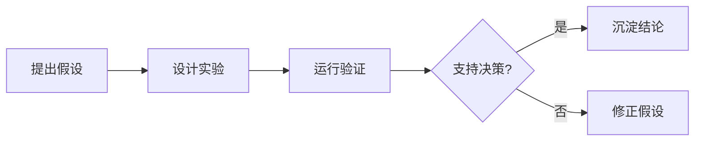

---
hide:
  - navigation
  - toc
---

<section class="farm-hero">
  <div class="farm-hero__shade"></div>
  <div class="game-hud">
    <span>今日任务：整理 1 篇笔记</span>
    <span>经验 +20</span>
    <span>晴天</span>
  </div>
  <div class="farm-hero__content">
    <p class="farm-eyebrow">Medical-VLM Game Notes</p>
    <h1><span>Medical-VLM</span><span>学习小镇</span></h1>
    <p class="farm-hero__lead">
      把医学视觉语言模型、工程实践、论文阅读和科研复盘，整理成可继续生长的公开学习笔记。
    </p>
    <div class="farm-actions">
      <a class="farm-button farm-button--primary" href="notes/">进入笔记田</a>
      <a class="farm-button" href="blog/">查看日志屋</a>
    </div>
  </div>
  <div class="farm-cloud farm-cloud--one"></div>
  <div class="farm-cloud farm-cloud--two"></div>
  
  <nav class="game-dock" aria-label="学习小镇快捷入口">
    <a href="notes/ai/">AI</a>
    <a href="notes/programming/">编程</a>
    <a href="notes/papers/">论文</a>
    <a href="notes/research/">科研</a>
    <a href="blog/">日志</a>
  </nav>
</section>

<section class="farm-section farm-section--intro">
  <div class="farm-section__head">
    <p class="farm-kicker">庄园地图</p>
    <h2>四块学习地</h2>
  </div>
  <div class="farm-grid">
    <a class="farm-card farm-card--ai" href="notes/ai/">
      <span class="farm-card__tag">AI Plot</span>
      <h3>AI 菜圃</h3>
      <p>模型结构、训练策略、评估指标和医学多模态边界。</p>
    </a>
    <a class="farm-card farm-card--code" href="notes/programming/">
      <span class="farm-card__tag">Code Barn</span>
      <h3>编程工坊</h3>
      <p>依赖、脚本、自动化、部署和可复现实验工具链。</p>
    </a>
    <a class="farm-card farm-card--paper" href="notes/papers/">
      <span class="farm-card__tag">Paper Mill</span>
      <h3>论文磨坊</h3>
      <p>阅读卡片、方法对照、证据强度和复现价值判断。</p>
    </a>
    <a class="farm-card farm-card--research" href="notes/research/">
      <span class="farm-card__tag">Research Field</span>
      <h3>科研试验田</h3>
      <p>假设、实验、结果复盘和下一步投入决策。</p>
    </a>
  </div>
</section>

<section class="farm-section farm-section--workflow">
  <div class="farm-section__head">
    <p class="farm-kicker">Season Loop</p>
    <h2>一次实验，一次收成</h2>
  </div>
  <div class="farm-steps">
    <div class="farm-step">
      <span>01</span>
      <strong>提出假设</strong>
      <p>先写清楚实验要支持的判断。</p>
    </div>
    <div class="farm-step">
      <span>02</span>
      <strong>运行验证</strong>
      <p>记录数据、代码版本和评价指标。</p>
    </div>
    <div class="farm-step">
      <span>03</span>
      <strong>沉淀结论</strong>
      <p>只保留能支撑后续决策的证据。</p>
    </div>
  </div>
</section>

## 研究片段

```python
def dice_score(intersection: float, prediction: float, target: float) -> float:
    return 2 * intersection / (prediction + target)
```

行内公式 \(p(y \mid x)\) 和块级公式：

\[
\mathcal{L} = -\sum_i y_i \log \hat{y}_i
\]


