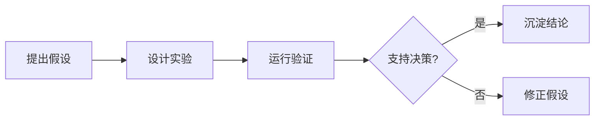

---
tags:
  - 学习笔记
  - Medical-VLM
---

# Medical-VLM 学习笔记

这里用于整理医学视觉语言模型、编程实践、论文阅读和科研流程中的公开学习笔记。

## 笔记入口

- [AI](notes/ai/index.md)：模型、训练、评估和部署。
- [编程](notes/programming/index.md)：工程实践、工具链和自动化。
- [论文](notes/papers/index.md)：论文阅读卡片和引用线索。
- [科研](notes/research/index.md)：问题拆解、实验设计和复盘。
- [博客](blog/index.md)：阶段性总结和公开学习记录。

## 记录原则

每篇笔记优先回答一个明确问题：当前结论支持什么判断，还缺少什么证据。实验记录应包含假设、数据、方法、指标、结果和下一步决策。

## 功能样例

代码块支持高亮和复制：

```python
def dice_score(intersection: float, prediction: float, target: float) -> float:
    return 2 * intersection / (prediction + target)
```

数学公式支持行内公式 \(p(y \mid x)\) 和块级公式：

\[
\mathcal{L} = -\sum_i y_i \log \hat{y}_i
\]

Mermaid 图表支持流程记录：


