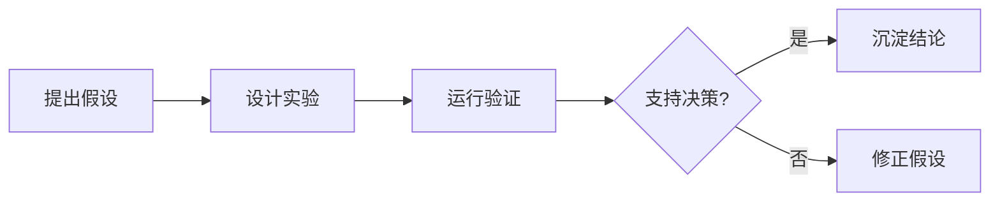

---
hide:
  - navigation
  - toc
---

<section class="farm-hero">
  <div class="farm-hero__shade"></div>
  <div class="game-hud">
    <span>今日任务：整理 1 篇公开笔记</span>
    <span>经验 +20</span>
    <span>阳光小镇</span>
  </div>
  <div class="farm-hero__content manor-login-panel">
    <p class="farm-eyebrow">Medical-VLM Manor Notes</p>
    <h1><span>Medical-VLM</span><span>摩尔笔记庄园</span></h1>
    <p class="farm-hero__lead">
      把医学视觉语言模型、工程实践、论文阅读和科研复盘，整理成一座可以继续扩建的学习庄园。
    </p>
    <div class="farm-actions">
      <a class="farm-button farm-button--primary" href="create/">新建笔记</a>
      <a class="farm-button" href="notes/">进入地图</a>
      <a class="farm-button" href="plans/">今日计划</a>
    </div>
  </div>
  <nav class="game-dock" aria-label="摩尔笔记庄园快捷入口">
    <a href="create/">写作</a>
    <a href="notes/ai/">AI</a>
    <a href="notes/papers/">论文</a>
    <a href="notes/research/">科研</a>
    <a href="blog/">日志</a>
  </nav>
</section>

<section class="farm-section farm-section--intro">
  <div class="farm-section__head">
    <p class="farm-kicker">庄园地图</p>
    <h2>四块学习地</h2>
  </div>
  <div class="farm-grid">
    <a class="farm-card farm-card--ai" href="notes/ai/">
      
      <span class="farm-card__tag">AI Plot</span>
      <h3>AI 菜圃</h3>
      <p>模型结构、训练策略、评估指标和医学多模态边界。</p>
    </a>
    <a class="farm-card farm-card--code" href="notes/programming/">
      
      <span class="farm-card__tag">Code Room</span>
      <h3>编程小屋</h3>
      <p>依赖、脚本、自动化、部署和可复现实验工具链。</p>
    </a>
    <a class="farm-card farm-card--paper" href="notes/papers/">
      
      <span class="farm-card__tag">Paper House</span>
      <h3>论文蘑菇屋</h3>
      <p>阅读卡片、方法对照、证据强度和复现价值判断。</p>
    </a>
    <a class="farm-card farm-card--research" href="notes/research/">
      
      <span class="farm-card__tag">Research Quest</span>
      <h3>科研任务榜</h3>
      <p>假设、实验、结果复盘和下一步投入决策。</p>
    </a>
  </div>
</section>

<section class="farm-section manor-quest-row">
  <a class="manor-quest-card" href="create/">
    <strong>创作台</strong>
    <span>选模板、填信息、生成 Markdown</span>
  </a>
  <a class="manor-quest-card" href="notes/papers/">
    <strong>论文库</strong>
    <span>按问题、方法、证据、复现价值读论文</span>
  </a>
  <a class="manor-quest-card" href="plans/">
    <strong>计划板</strong>
    <span>把阅读、实验、写作和发布拆成任务</span>
  </a>
</section>

<section class="farm-section manor-study-room">
  <div class="manor-study-room__panel">
    <p class="farm-kicker">Study Room</p>
    <h2>今日学习公告</h2>
    <p>先把原始材料放进本地 `inbox/`，只把确认可公开的笔记整理进庄园。</p>
    <div class="manor-task-list">
      <span>读一篇论文</span>
      <span>补一段代码</span>
      <span>写一条结论</span>
    </div>
  </div>
</section>

<section class="farm-section farm-section--workflow">
  <div class="farm-section__head">
    <p class="farm-kicker">Season Loop</p>
    <h2>一次实验，一次收成</h2>
  </div>
  <div class="farm-steps">
    <div class="farm-step">
      <span>01</span>
      <strong>提出假设</strong>
      <p>先写清楚实验要支持的判断。</p>
    </div>
    <div class="farm-step">
      <span>02</span>
      <strong>运行验证</strong>
      <p>记录数据、代码版本和评价指标。</p>
    </div>
    <div class="farm-step">
      <span>03</span>
      <strong>沉淀结论</strong>
      <p>只保留能支撑后续决策的证据。</p>
    </div>
  </div>
</section>

## 研究片段

```python
def dice_score(intersection: float, prediction: float, target: float) -> float:
    return 2 * intersection / (prediction + target)
```

行内公式 \(p(y \mid x)\) 和块级公式：

\[
\mathcal{L} = -\sum_i y_i \log \hat{y}_i
\]


