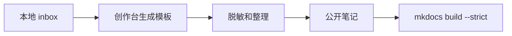

---
tags:
  - 学习笔记
---

# 学习地图

<section class="manor-page-hero manor-page-hero--notes">
  

    
Notes Map

    <h2>把学习材料分成可维护的地块</h2>
    
未整理、含隐私或未确认可公开的材料先放在本地 `inbox/`。进入 Git 的内容必须是已经脱敏、可公开、可复查的笔记。

  

</section>

  <a class="manor-link-card" href="ai/">
    
    <strong>AI 菜圃</strong>
    模型、训练、评估、部署。
  </a>
  <a class="manor-link-card" href="programming/">
    
    <strong>编程小屋</strong>
    脚本、依赖、自动化、工程问题。
  </a>
  <a class="manor-link-card" href="papers/">
    
    <strong>论文蘑菇屋</strong>
    论文卡片、方法比较、复现判断。
  </a>
  <a class="manor-link-card" href="research/">
    
    <strong>科研任务榜</strong>
    假设、实验、结果复盘、下一步决策。
  </a>

## 笔记写作原则

每篇笔记优先回答一个明确问题：当前结论支持什么判断，还缺少什么证据。实验记录应包含假设、数据、方法、指标、结果和下一步决策。

